# Production-Style Batch Data Lake Platform on AWS

A production-style batch data pipeline built entirely on AWS, processing real US domestic flight data sourced from the Bureau of Transportation Statistics via Kaggle. The pipeline ingests raw CSV data into S3, automatically triggers on upload via EventBridge, and processes it through a Bronze-Silver-Gold medallion architecture using AWS Glue and PySpark — cleaning, validating, and aggregating 463,000 flight records into business-ready metrics. Results are tracked in DynamoDB, monitored via CloudWatch, queryable through Athena, and visualized in a live Power BI dashboard. No manual intervention required after the initial upload.

---

## Stack

  
  
  
  
  

---

## Architecture

1. Flight data CSV uploaded to S3 Bronze
2. EventBridge detects the upload, triggers Step Functions state machine
3. Glue Job 1 cleans, validates, and partitions data → writes to S3 Silver
4. Glue Job 2 computes five business aggregations → writes to S3 Gold
5. DynamoDB logs pipeline run status throughout execution via direct SDK integration
6. CloudWatch monitors Step Functions and Glue — SNS sends email alert on failure
7. Gold Parquet files registered as external tables in Glue Data Catalog
8. Athena queries Gold layer via Glue Data Catalog
9. Power BI connects to Athena via ODBC driver → live dashboard, no data exports

---

## AWS Services

| Service | Role |
|---|---|
| S3 | Bronze / Silver / Gold storage — raw CSV, cleaned Parquet, aggregated Parquet |
| AWS Glue + PySpark | ETL — cleaning, validation, type casting, deduplication, aggregation |
| Step Functions | Orchestration — sequential execution with retry logic and catch blocks |
| DynamoDB | Metadata tracking — audit trail of every pipeline run with status and timestamps |
| EventBridge | Event-driven trigger — detects S3 object creation, starts state machine |
| Athena | Serverless SQL queries directly on S3 Gold Parquet files |
| Glue Data Catalog | Metadata registry — schema definitions and S3 path mappings for Athena |
| CloudWatch | Monitoring — execution metrics, job durations, failure alarms, live dashboard |
| SNS | Alerting — email notification on pipeline failure |
| Power BI | Business dashboard — ODBC connection to Athena, live data |
| IAM | Least-privilege service roles — no hardcoded credentials anywhere |

---

## Dataset

US Bureau of Transportation Statistics — Flight Delay and Cancellation Data 2023.
Sourced via [Kaggle](https://www.kaggle.com/datasets/patrickzel/flight-delay-and-cancellation-dataset-2019-2023). 463,000 flight records across January — August 2023, ~98MB raw CSV.

---

## Medallion Architecture

**Bronze** — Raw CSV as uploaded. No transformation. Stored under ingestion date partitioned path `year=YYYY/month=MM/day=DD/`.

**Silver** — Cleaned and validated Parquet. 20+ columns standardized and cast. Nulls handled, duplicates removed, data quality validated. Partitioned by year/month/day for query efficiency.

**Gold** — Five pre-aggregated business metric tables. Flat Parquet, ready for direct SQL and BI consumption.

---

## Partition Pruning

Silver layer partitioning enables Athena to skip irrelevant data on filtered queries — directly reducing cost and query time.

| Query | Data Scanned |
|---|---|
| `SELECT * FROM silver_flights LIMIT 10` — no filter | 541 KB |
| `SELECT * WHERE year=2023 AND month=1 AND day=1` | 26 KB |

95% reduction in data scanned by filtering on partition keys.

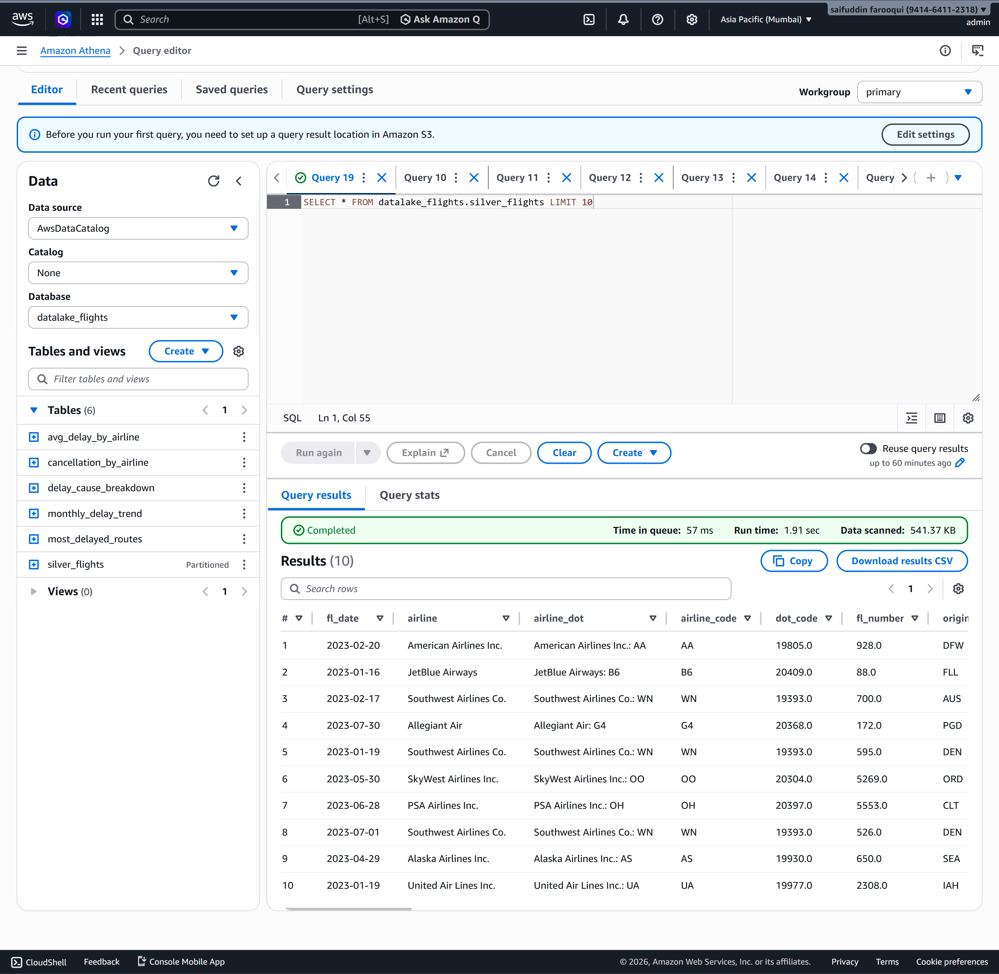
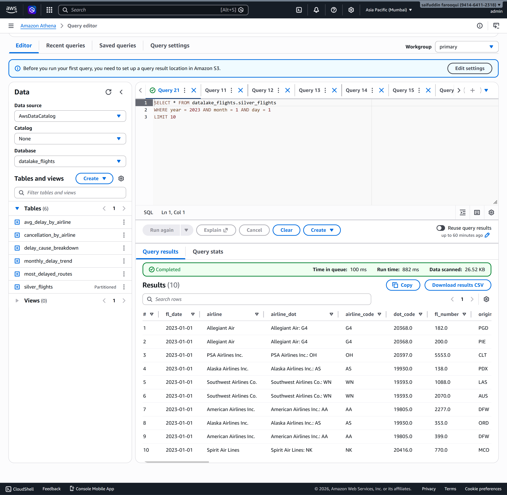

---

## Key Insights

- **Most delayed airline:** Frontier Airlines Inc. — 22+ minutes average arrival delay
- **Highest cancellation rate:** Republic Airline — 3.3% of all flights cancelled
- **Top delay cause:** Late Aircraft — 40.62% of total national delay minutes (3.01M minutes)
- **Worst month:** July 2023 — peak average arrival and departure delays
- **Most delayed route:** GEG → ORD — 234 minutes average arrival delay
- **Departure delay (14.42 min) consistently exceeds arrival delay (10.26 min)** — pilots recover time in air

---

## Dashboard

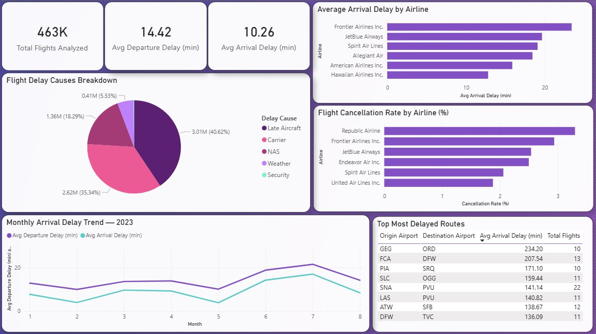

---

## Monitoring

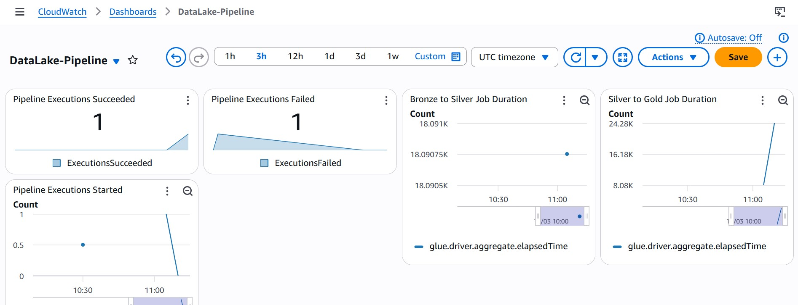

Pipeline failure triggers a CloudWatch alarm → SNS email notification within one minute. DynamoDB records FAILED status with error message captured from Step Functions context.

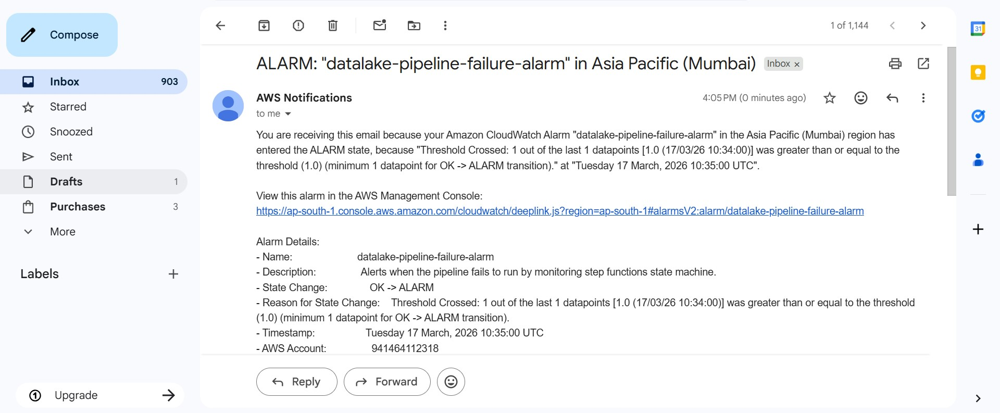

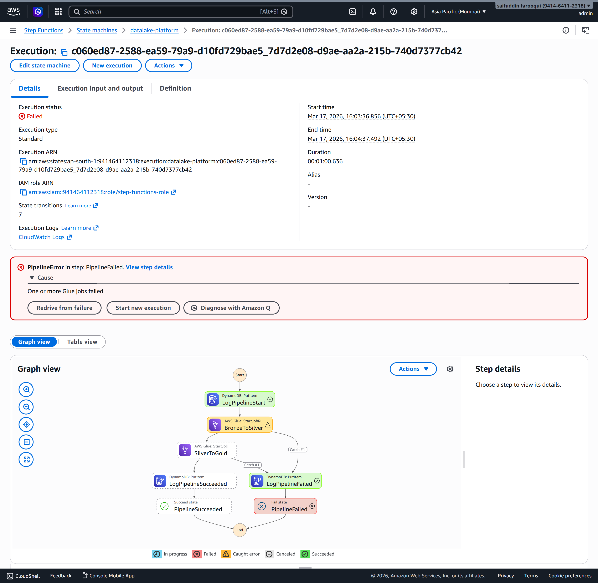

---

## Pipeline Execution

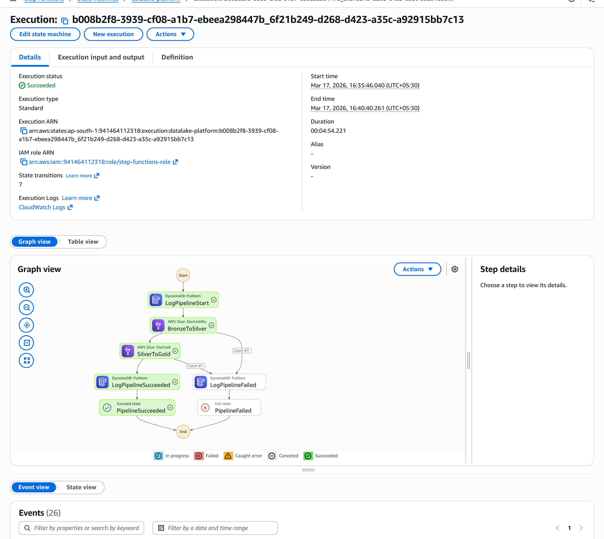

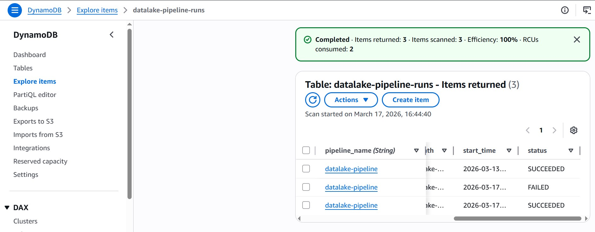

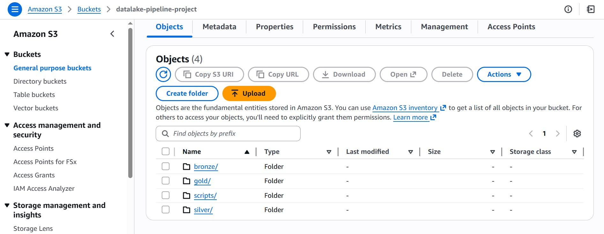

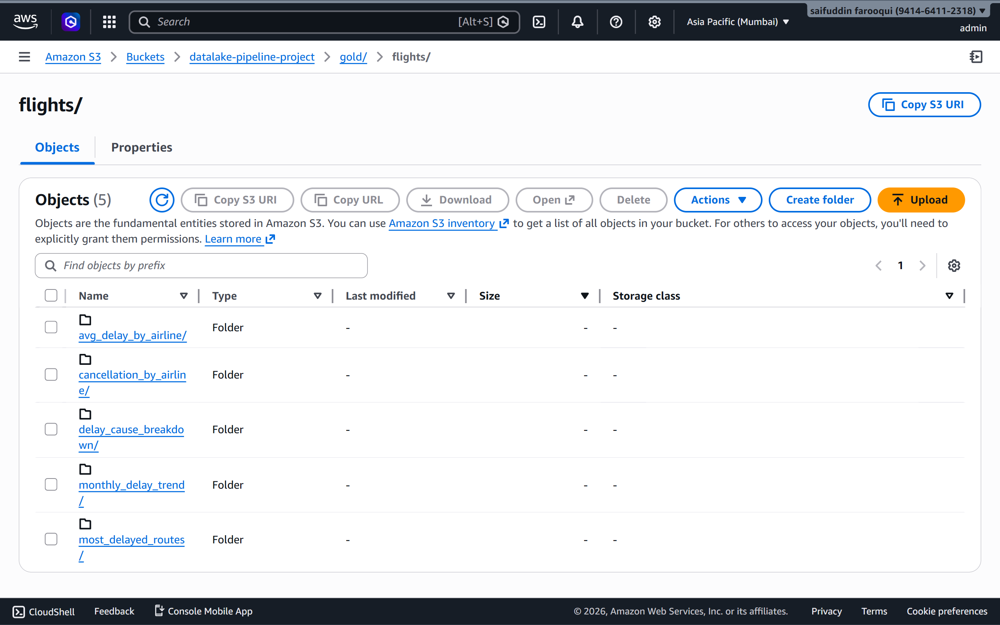

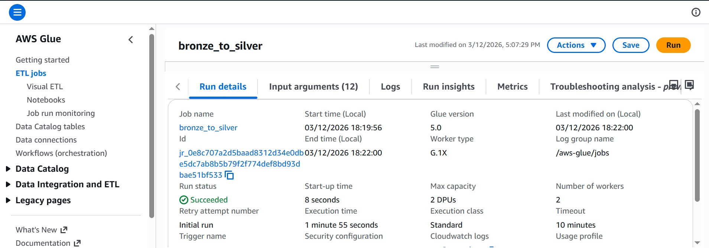

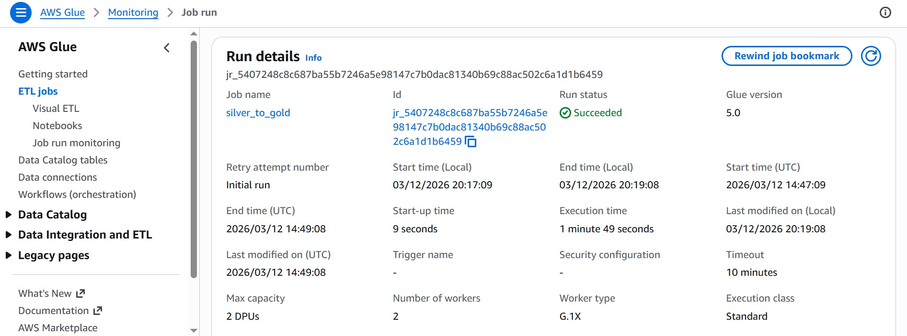

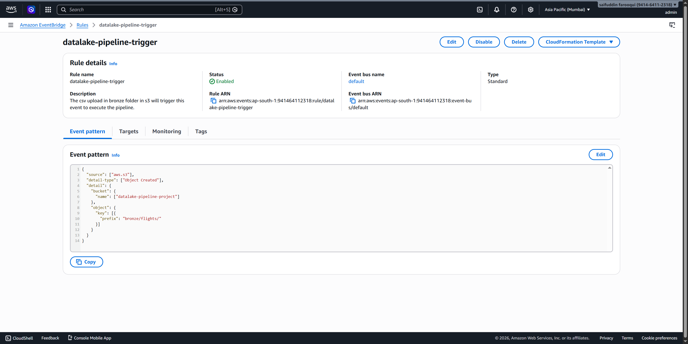

---

## Analytical Queries

Five business queries on Gold layer — [`queries/business_queries.sql`](queries/business_queries.sql):

1. Which airlines have the highest average arrival delay?
2. Which airlines have the highest flight cancellation rate?
3. What is the biggest cause of flight delays in the US by total minutes lost?
4. Which flight routes have the worst average arrival delays?
5. Which months experience the highest average arrival delays?

---

## Challenges

**Glue script path** — Glue silently loaded a 0-byte script when the S3 path was misconfigured, causing jobs to report Succeeded without processing any data. Learned to always verify script file size in S3 before running.

**Incremental check** — Initial S3 partition existence check fired on stray empty folder objects, silently skipping all processing. Replaced with EventBridge trigger-based logic — pipeline only runs when new Bronze data actually arrives.

**Step Functions permissions** — State machine failed instantly before Glue started due to missing IAM permissions on the execution role. Built permissions up incrementally per phase rather than attaching broad policies upfront, which made each failure easier to diagnose.

**Small files** — Day-level Silver partitioning produced hundreds of 35-40KB Parquet files per partition. Month-level partitioning would be more appropriate for this dataset size — noted as a known design tradeoff.
